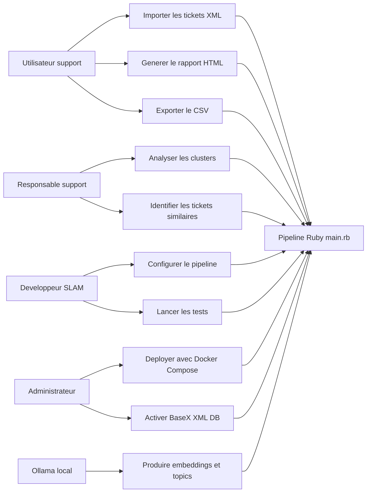

# 02 - Analyse

## Acteurs

| Acteur | Role |
|---|---|
| Utilisateur support | Lance le pipeline et consulte le rapport |
| Responsable support | Exploite les clusters, les tendances et les tickets similaires |
| Developpeur SLAM | Maintient les scripts Ruby et les tests |
| Administrateur technique | Configure `.env`, Docker, Ollama et BaseX |
| Systeme Ollama | Fournit les embeddings et la generation de titres |
| BaseX XML DB | Stocke ou restitue le fichier XML via REST lorsque l'option est active |

## Diagramme des cas d'utilisation

## Regles metier

| ID | Regle |
|---|---|
| RM-01 | Un ticket est identifie par son `nice_id` lorsqu'il est present. |
| RM-02 | Le texte analyse est compose du sujet, de la description et des commentaires du ticket. |
| RM-03 | Le XML est parse en streaming afin d'eviter le chargement complet en memoire. |
| RM-04 | Si `MAX_TICKETS` est defini et positif, le parsing s'arrete apres ce nombre de tickets. |
| RM-05 | Les embeddings sont generes uniquement si `RUN_EMBEDDINGS=true`. |
| RM-06 | Les textes trop longs sont normalises puis tronques avec conservation du debut et de la fin. |
| RM-07 | Le clustering est lance uniquement si `RUN_CLUSTERING=true` et si le fichier d'embeddings existe. |
| RM-08 | Le nombre de clusters utilise est `min(KMEANS_K, nombre_de_vecteurs)`. |
| RM-09 | Les titres de clusters sont optionnels et dependent de `RUN_CLUSTER_TOPICS`. |
| RM-10 | La detection de doublons probables repose sur la similarite cosinus et `SIMILARITY_THRESHOLD`. |
| RM-11 | Le CSV doit rester generable meme si certains fichiers analytiques manquent. |
| RM-12 | Si Ollama est indisponible et `SKIP_OLLAMA_ON_ERROR=true`, le pipeline continue en mode degrade. |
| RM-13 | Si BaseX est indisponible, le pipeline revient au fichier XML local. |
| RM-14 | En fin d'execution, Ollama est arrete uniquement si le script l'a lui-meme demarre. |

## Analyse des donnees

Les donnees source sont des tickets XML. Le mapping principal est defini dans `xml_handler.rb`.

Entites metier observees:

- ticket: `nice_id`, `subject`, `description`, statut, priorite, dates, tags, demandeur;
- commentaire: auteur, date, visibilite, texte;
- champ personnalise: identifiant de champ et valeur;
- embedding: vecteur numerique associe a un ticket;
- cluster: regroupement numerique obtenu par KMeans;
- topic: titre court produit par LLM local pour un cluster;
- similarite: score cosinus entre deux tickets.

## Justification des choix technologiques

| Choix | Justification |
|---|---|
| Ruby | Langage simple pour scripts batch, parsing XML, fichiers JSON/CSV et tests RSpec. |
| Nokogiri | Bibliotheque robuste pour parser le XML, avec `XML::Reader` adapte aux gros fichiers. |
| Ollama | Execution locale des modeles IA pour proteger les donnees support. |
| `nomic-embed-text-v2-moe` | Modele d'embeddings recommande dans le README pour la vectorisation semantique. |
| `llama3.2:1b-instruct` | Modele LLM local leger recommande pour generer des titres courts. |
| KMeans maison dans `MlUtils` | Controle pedagogique de l'algorithme et tests unitaires possibles. |
| Similarite cosinus | Mesure classique pour comparer des vecteurs d'embeddings. |
| JSON | Format simple pour les sorties intermediaires du pipeline. |
| CSV avec `;` | Compatible avec Excel/LibreOffice dans un contexte francophone. |
| HTML statique | Livrable facilement consultable sans backend web complexe. |
| Docker Compose | Reproductibilite de l'environnement avec frontend, app Ruby/Ollama et BaseX. |
| BaseX | Base NoSQL XML coherente avec la nature des donnees source. |
| RSpec | Framework de tests adapte a Ruby. |

## Limites identifiees

- Le projet n'expose pas encore d'API REST metier pour consulter les resultats.
- Les donnees applicatives ne sont pas persistees dans une base relationnelle en production; le MLD sert de reference et de projection.
- L'interface frontend Docker est un portail statique vers les fichiers generes.
- La qualite des clusters depend du choix de `KMEANS_K`, du modele d'embeddings et de la qualite du texte source.

