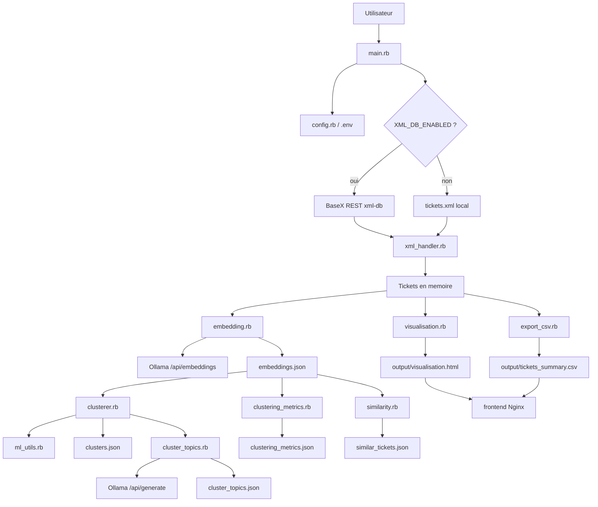
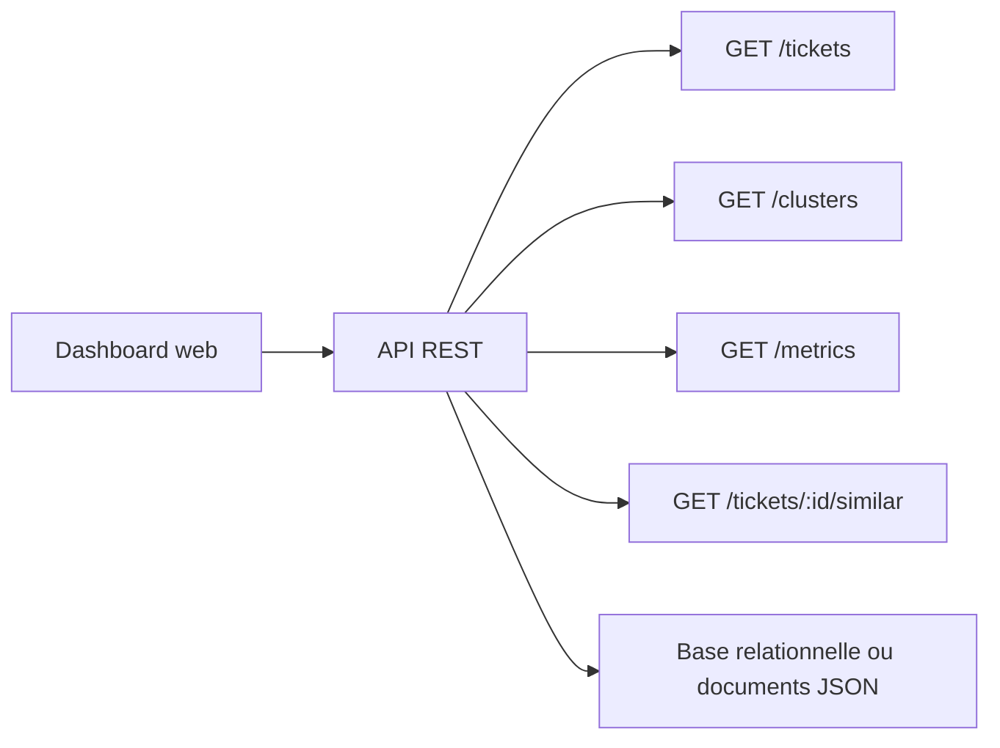
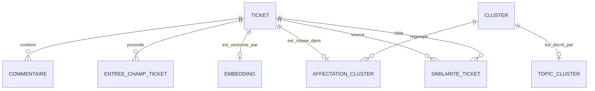
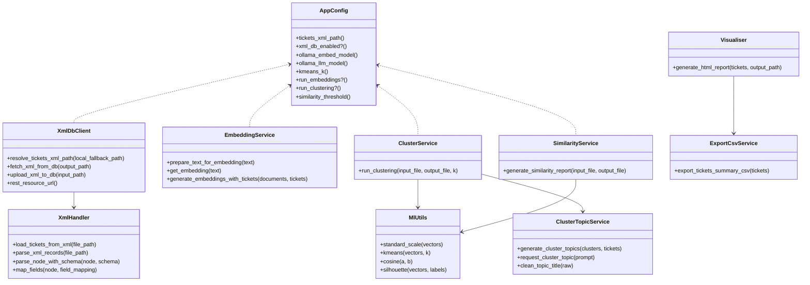
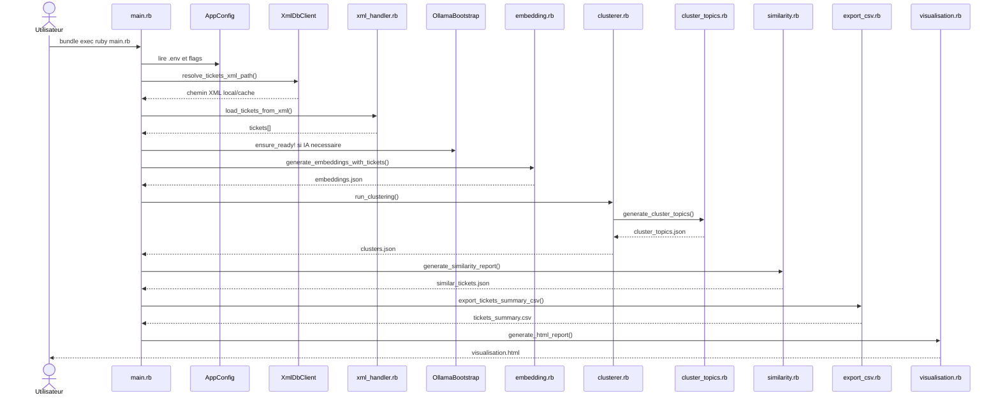
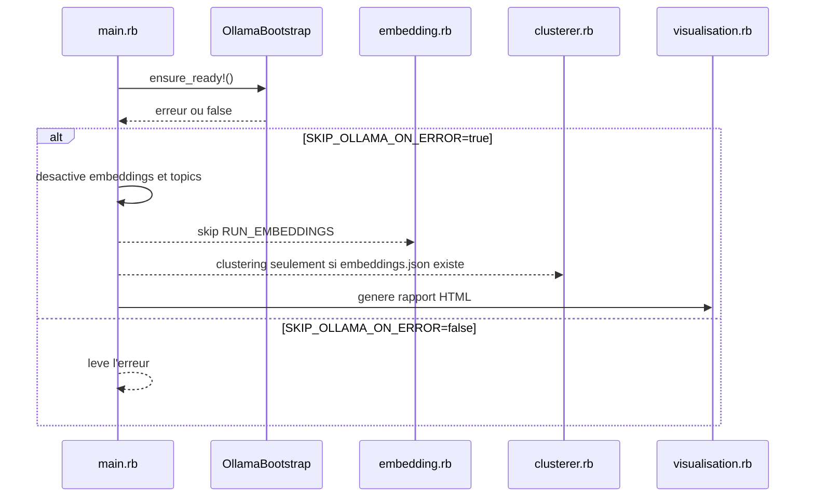

# 03 - Conception

## Architecture applicative actuelle

Le projet fonctionne comme une architecture batch modulaire:

- entree: fichier XML local ou XML recupere depuis BaseX REST;
- traitement: scripts Ruby;
- IA locale: Ollama pour embeddings et titres;
- sorties: JSON, CSV et HTML;
- diffusion: frontend Nginx statique en Docker.

## Architecture MVC / API REST

L'application actuelle n'est pas une application MVC classique. Pour l'analyse BTS SIO SLAM, on peut la positionner ainsi:

| Couche | Element actuel | Evolution possible |
|---|---|---|
| Modele | Structures Ruby Hash issues du XML, fichiers JSON, schema SQL de reference | Classes `Ticket`, `Comment`, `Cluster`, persistance SQL |
| Vue | `visualisation.rb` genere du HTML, `docker/frontend/index.html` liste les livrables | Dashboard interactif |
| Controleur | `main.rb` orchestre le pipeline | API REST avec routes `/tickets`, `/clusters`, `/metrics` |
| Service | `embedding.rb`, `clusterer.rb`, `similarity.rb`, `export_csv.rb` | Services applicatifs reutilisables par API |

Projection REST cible:

## MCD

Le MCD complet est fourni dans [mcd.mmd](mcd.mmd).

## MLD

Le MLD complet est fourni dans [mld.mmd](mld.mmd). Un script SQL de reference existe deja dans `docs/bts_sio/sql/01_schema.sql`.

Tables de reference:

- `tickets`
- `comments`
- `embeddings`
- `clusters`
- `cluster_assignments`
- `cluster_topics`
- `ticket_similarities`

## Diagramme de classes

## Diagramme de sequence - execution complete

## Diagramme de sequence - mode degrade Ollama

## Maquette fonctionnelle

Le frontend Docker (`docker/frontend/index.html`) est un portail statique listant les livrables:

- lien vers `/reports/visualisation.html`;
- lien vers `/reports/tickets_summary.csv`.

Le rapport HTML genere par `visualisation.rb` contient des sections de synthese, graphiques et tableaux. Les sorties attendues sont:

| Zone | Objectif |
|---|---|
| Synthese | Nombre de tickets, activite, indicateurs globaux |
| Graphiques | Evolution quotidienne, cumul, tags principaux |
| Analyse themes | Clusters et topics lorsqu'ils sont disponibles |
| Similarite | Identification de tickets proches ou doublons |
| Export | Consultation HTML et exploitation CSV |

