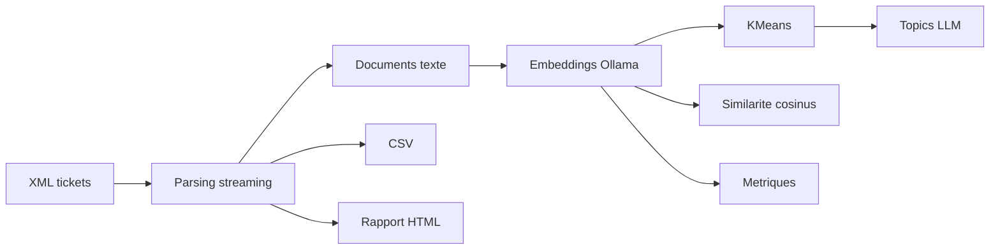

# 04 - Realisation

## Environnement de developpement

| Element | Valeur observee |
|---|---|
| Langage | Ruby |
| Version minimale | Ruby `>= 3.3.10` dans `Gemfile` |
| Gestionnaire | Bundler |
| Dependances | `dotenv`, `httparty`, `nokogiri`, `rspec` en dev/test |
| IA locale | Ollama |
| Base XML optionnelle | BaseX via image `basex/basexhttp:latest` |
| Frontend | HTML statique servi par Nginx |
| Tests | RSpec |
| Conteneurisation | Dockerfile + Docker Compose |

## Depot Git

Depot distant configure:

```text
https://github.com/Farounaga/rb_tkts
```

## Structure technique

| Fichier / dossier | Role |
|---|---|
| `main.rb` | Point d'entree et orchestration du pipeline |
| `config.rb` | Configuration centralisee via `.env` / variables d'environnement |
| `xml_handler.rb` | Parsing XML streaming et mapping des champs |
| `xml_db_client.rb` | Lecture/import du XML dans BaseX via REST |
| `embedding.rb` | Generation des embeddings avec Ollama |
| `clusterer.rb` | Clustering KMeans a partir des embeddings |
| `cluster_topics.rb` | Generation des titres de clusters avec LLM local |
| `ml_utils.rb` | Fonctions mathematiques: scale, distances, KMeans, silhouette |
| `clustering_metrics.rb` | Calcul elbow et silhouette |
| `similarity.rb` | Similarite cosinus top-k |
| `export_csv.rb` | Export CSV metier |
| `visualisation.rb` | Generation du rapport HTML |
| `ollama_bootstrap.rb` | Demarrage, verification, pull et arret d'Ollama |
| `bin/check_env.rb` | Diagnostic rapide des dependances et variables |
| `docker/frontend` | Portail statique Nginx |
| `spec` | Tests unitaires RSpec |
| `sample_data/tickets_demo_50.xml` | Jeu de demonstration |

## Pipeline realise



## Configuration

Les variables principales sont documentees dans `.env.example`.

| Variable | Usage |
|---|---|
| `TICKETS_XML_PATH` | Chemin du fichier XML source |
| `MAX_TICKETS` | Limite optionnelle pour les tests rapides |
| `OLLAMA_BASE_URL` | URL du serveur Ollama |
| `OLLAMA_EMBED_MODEL` | Modele d'embeddings |
| `OLLAMA_LLM_MODEL` | Modele de generation des topics |
| `KMEANS_K` | Nombre cible de clusters |
| `RUN_EMBEDDINGS` | Active/desactive les embeddings |
| `RUN_CLUSTERING` | Active/desactive le clustering |
| `RUN_CLUSTER_TOPICS` | Active/desactive les titres LLM |
| `RUN_SIMILARITY` | Active/desactive les tickets similaires |
| `RUN_CLUSTERING_METRICS` | Active/desactive les metriques |
| `RUN_EXPORT_CSV` | Active/desactive l'export CSV |
| `XML_DB_ENABLED` | Active/desactive BaseX |

## Base de donnees

Le fonctionnement actuel est hybride:

- fichier XML local en entree;
- BaseX XML DB optionnelle via `xml_db_client.rb`;
- sorties JSON/CSV/HTML sur disque;
- schema SQL de reference fourni pour la soutenance.

Scripts existants:

- `docs/bts_sio/sql/01_schema.sql`
- `docs/bts_sio/sql/02_seed_minimal.sql`

## Docker et deploiement

Le fichier `docker-compose.yml` definit trois services:

| Service | Role | Port |
|---|---|---|
| `frontend` | Nginx, expose les livrables generes | `${FRONTEND_PORT:-18080}:80` |
| `app-llm` | Pipeline Ruby + Ollama dans le conteneur | interne |
| `xml-db` | BaseX HTTP pour base XML | `8984:8984` |

Commande:

```bash
docker compose up --build
```

URLs:

- `http://localhost:18080`
- `http://localhost:18080/reports/visualisation.html`
- `http://localhost:18080/reports/tickets_summary.csv`

