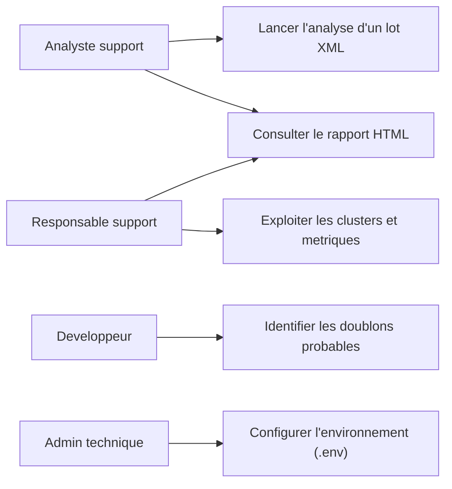

# 02 - Analyse

## 2.1 Diagramme des cas d'utilisation

## 2.2 Analyse fonctionnelle

Le traitement metier suit un pipeline:
1. Lecture XML (tickets + commentaires + champs).
2. Construction d'un document textuel par ticket.
3. Embedding semantique local.
4. Clustering KMeans.
5. Generation de titres de clusters.
6. Calcul de metriques (elbow, silhouette).
7. Detection de similarites cosinus.
8. Generation de rapport HTML.

## 2.3 Regles metier

1. Le ticket doit avoir un `nice_id` exploitable pour etre trace dans les sorties.
2. Le traitement peut etre limite par `MAX_TICKETS` pour des runs de demonstration.
3. Les embeddings sont generes uniquement si `RUN_EMBEDDINGS=true`.
4. Le clustering est execute uniquement si `RUN_CLUSTERING=true`.
5. Les themes de clusters peuvent etre desactives via `RUN_CLUSTER_TOPICS=false`.
6. Un doublon probable est marque si `similarity >= SIMILARITY_THRESHOLD`.
7. Le nombre de voisins retournes est borne par `SIMILARITY_TOP_K`.
8. Les modeles IA utilises doivent rester locaux (Ollama) pour la confidentialite.

## 2.4 Justification des choix technologiques

### Langage et ecosysteme

- **Ruby**: langage maitrisable en BTS SIO, syntaxe lisible, ecosysteme mature.
- **Bundler/Gemfile**: gestion claire des dependances.
- **RSpec**: standard de test unitaire Ruby.

### Parsing et traitement de donnees

- **Nokogiri**: parsing XML fiable et performant.
- **JSON**: format de sortie simple pour echanger entre etapes.

### IA et machine learning

- **Ollama local**: execution IA hors cloud pour respecter la confidentialite.
- **Rumale + numo-narray**: outillage ML Ruby pour KMeans.
- **Methode cosinus**: pertinente pour mesurer la proximite semantique entre embeddings.

### Sortie metier

- **Rapport HTML**: consultation simple sans dependance lourde cote utilisateur.

## 2.5 Alternatives et arbitrages

- Alternative Python (pandas/sklearn): plus riche en ML, mais projet deja structure en Ruby.
- Alternative cloud (OpenAI, etc.): plus simple pour certains modeles, mais moins acceptable pour des donnees sensibles.
- Base SQL obligatoire des le debut: non retenu dans le flux MVP, mais schema prevu dans le dossier BTS (cf. `sql/01_schema.sql`).
