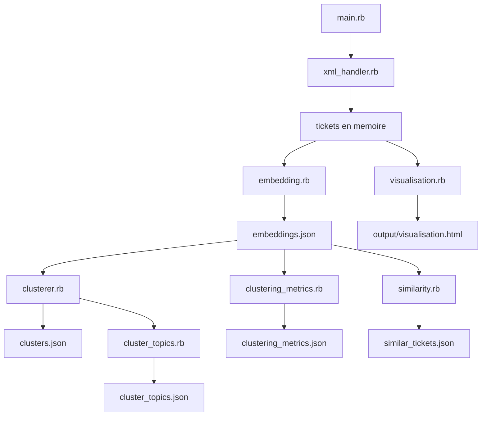
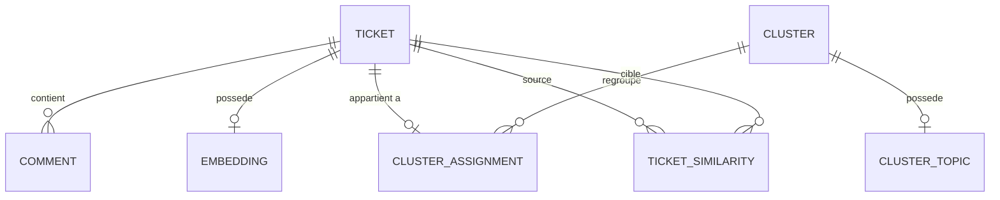
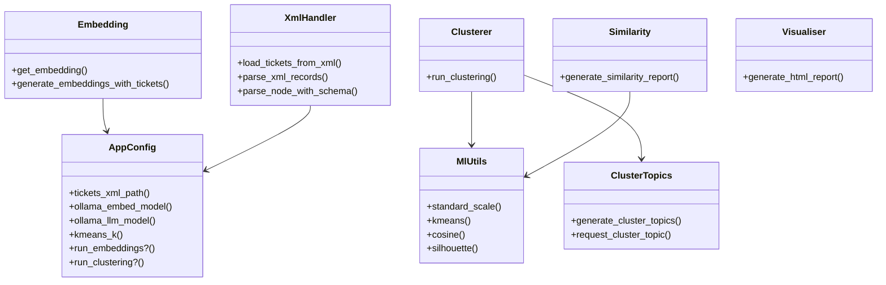
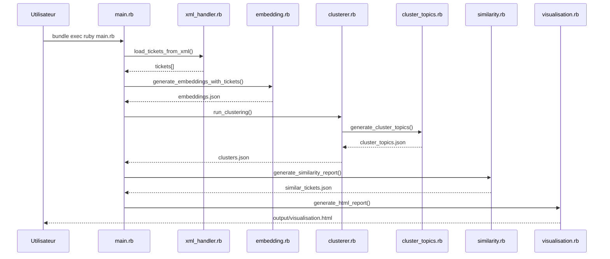

# 03 - Conception

## 3.1 Architecture applicative

Architecture actuelle: pipeline de traitement batch en Ruby.

Projection evolutive possible: exposition d'un service API REST pour consulter les resultats.

### Projection MVC + API REST (cible)

- **Modele**: acces aux entites `Ticket`, `Comment`, `Cluster`, `Similarity`.
- **Controleur**: endpoints REST (`/tickets`, `/clusters`, `/metrics`).
- **Vue**: dashboard web (ou front SPA) consommant l'API.
- **API REST**: format JSON, pagination des tickets, filtres par cluster/periode/statut.

## 3.2 MCD (Modele Conceptuel de Donnees)

Le MVP fonctionne principalement sur fichiers JSON, mais un modele relationnel de reference est defini pour la soutenance.

## 3.3 MLD (Modele Logique de Donnees)

Tables retenues:
- `tickets(id, nice_id, subject, description, created_at, updated_at, status_id, priority_id, requester_id, raw_payload_json)`
- `comments(id, ticket_id, author_id, created_at, value, is_public)`
- `embeddings(ticket_id, vector_json, model_name, created_at)`
- `clusters(id, label, created_at)`
- `cluster_assignments(ticket_id, cluster_id, assigned_at)`
- `cluster_topics(cluster_id, topic_title, model_name, created_at)`
- `ticket_similarities(source_ticket_id, target_ticket_id, similarity_score, probable_duplicate, created_at)`

Le script SQL associe est fourni: `docs/bts_sio/sql/01_schema.sql`.

## 3.4 Diagramme de classes (niveau code)

## 3.5 Diagramme de sequence (run complet)

## 3.6 Maquette (rapport HTML - vue cible)

Ecran de sortie souhaite:
1. Bandeau de synthese: nombre de tickets, nombre de clusters, taux de doublons probables.
2. Bloc "Top clusters": label cluster + volume + exemple de ticket.
3. Bloc "Tickets similaires": top-k par ticket.
4. Bloc "Metrices": silhouette + courbe elbow.
5. Bloc "Filtres": periode, cluster, statut.
