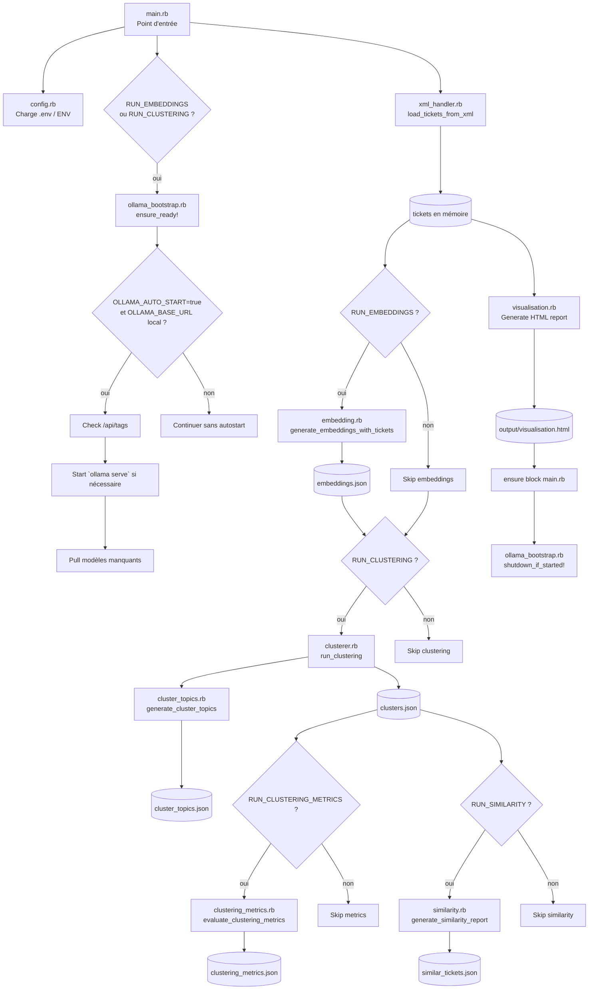
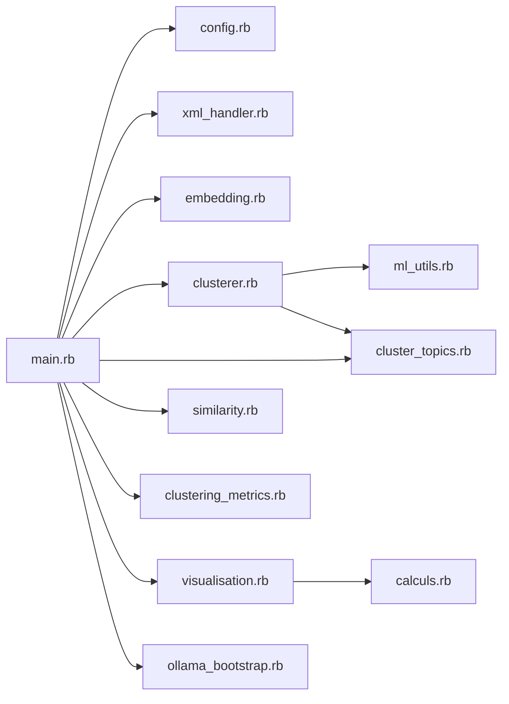

# Schéma de fonctionnement du code

Ce document décrit le **flux d'exécution réel** du projet (pipeline principal + dépendances).

## 1) Vue d'ensemble (pipeline)

## 2) Dépendances principales

## 3) Entrées / sorties

- Entrée principale:
  - `TICKETS_XML_PATH` → XML tickets.
- Sorties pipeline:
  - `embeddings.json`
  - `clusters.json`
  - `cluster_topics.json`
  - `clustering_metrics.json`
  - `similar_tickets.json`
  - `output/visualisation.html`

## 4) Notes d'architecture (actuel)

- Le XML est lu en streaming au démarrage (`main.rb`) avec une limite optionnelle `MAX_TICKETS`, via un schéma de mapping configurable dans `xml_handler.rb`, puis rechargé dans `clusterer.rb` pour la phase topics.
- Le bootstrap Ollama n'agit que si une étape Ollama est activée (`embeddings` ou `clustering`).
- Si `OLLAMA_MODELS` est défini, il a priorité pour le préchargement des modèles ; sinon le code se base sur `OLLAMA_EMBED_MODEL` / `OLLAMA_LLM_MODEL`.
- En fin de run, `main.rb` appelle `shutdown_if_started!` : le process Ollama est arrêté uniquement s'il a été lancé automatiquement par ce run.
