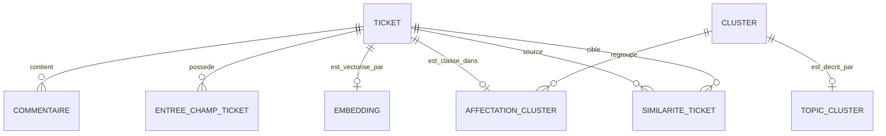
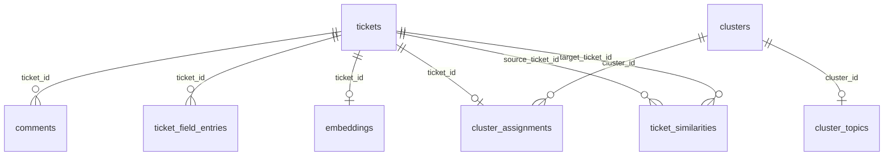

# Explication MCD / MLD - SYADEM Ticket Analysis Toolkit

## 1. Contexte donnees

Le projet manipule principalement des tickets support issus d'un export XML. Le code actuel fonctionne avec des fichiers XML, JSON et CSV, et propose une base XML BaseX optionnelle. Pour la conception BTS SIO SLAM, un MCD et un MLD de reference permettent de formaliser les entites et relations metier.

## 2. MCD

## 3. Entites du MCD

| Entite | Role |
|---|---|
| `TICKET` | Element central importe depuis le XML |
| `COMMENTAIRE` | Message associe a un ticket |
| `ENTREE_CHAMP_TICKET` | Champ personnalise provenant du XML |
| `EMBEDDING` | Representation vectorielle du ticket |
| `CLUSTER` | Groupe numerique issu de KMeans |
| `AFFECTATION_CLUSTER` | Association entre ticket et cluster |
| `TOPIC_CLUSTER` | Titre lisible genere pour un cluster |
| `SIMILARITE_TICKET` | Relation de proximite entre deux tickets |

## 4. Cardinalites

| Relation | Cardinalite | Justification |
|---|---|---|
| Ticket - Commentaire | 1,n | Un ticket peut contenir plusieurs commentaires |
| Ticket - Entree champ | 1,n | Un ticket peut posseder plusieurs champs personnalises |
| Ticket - Embedding | 0,1 | L'embedding depend de l'execution IA |
| Ticket - Affectation cluster | 0,1 | Le ticket n'est classe que si le clustering est lance |
| Cluster - Affectation cluster | 1,n | Un cluster regroupe plusieurs tickets |
| Cluster - Topic | 0,1 | Le topic est optionnel selon `RUN_CLUSTER_TOPICS` |
| Ticket - Similarite | 0,n | Un ticket peut avoir plusieurs tickets similaires |

## 5. MLD

## 6. Tables principales

| Table | Cle primaire | Description |
|---|---|---|
| `tickets` | `id` | Tickets importes |
| `comments` | `id` | Commentaires lies aux tickets |
| `ticket_field_entries` | `id` | Champs personnalises |
| `embeddings` | `ticket_id` | Vecteurs d'embeddings |
| `clusters` | `id` | Clusters KMeans |
| `cluster_assignments` | `ticket_id` | Affectation d'un ticket a un cluster |
| `cluster_topics` | `cluster_id` | Libelle lisible de cluster |
| `ticket_similarities` | `(source_ticket_id, target_ticket_id)` | Similarites entre tickets |

## 7. Correspondance avec les fichiers du projet

| Concept | Fichier actuel |
|---|---|
| Tickets et commentaires | `xml_handler.rb`, `tickets.xml` |
| Embeddings | `embedding.rb`, `embeddings.json` |
| Clusters | `clusterer.rb`, `clusters.json` |
| Topics | `cluster_topics.rb`, `cluster_topics.json` |
| Similarites | `similarity.rb`, `similar_tickets.json` |
| Metriques | `clustering_metrics.rb`, `clustering_metrics.json` |
| Export metier | `export_csv.rb`, `output/tickets_summary.csv` |
| Schema SQL de reference | `docs/bts_sio/sql/01_schema.sql` |

## 8. Choix de conception

Le modele separe les tickets, commentaires et champs personnalises pour eviter la duplication. Les resultats analytiques sont egalement separes, car ils peuvent etre recalcules avec d'autres parametres:

- modele d'embeddings different;
- valeur `KMEANS_K` differente;
- seuil de similarite different;
- generation de topics activee ou non.

Cette separation facilite l'historisation future et l'ajout d'une API REST.

