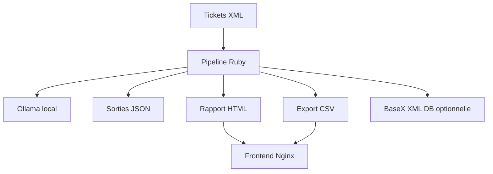

# Stack technique - SYADEM Ticket Analysis Toolkit

## Vue d'ensemble

Le projet utilise une stack orientee pipeline de donnees et analyse locale:

## Langage et runtime

| Element | Choix |
|---|---|
| Langage | Ruby |
| Version | `>= 3.3.10` |
| Gestionnaire dependances | Bundler |
| Point d'entree | `main.rb` |

## Dependances Ruby

| Gem | Usage |
|---|---|
| `dotenv` | Chargement de `.env` |
| `httparty` | Appels HTTP vers Ollama |
| `nokogiri` | Parsing XML |
| `rspec` | Tests unitaires en developpement/test |

## IA locale

| Element | Usage |
|---|---|
| Ollama | Serveur local de modeles |
| `/api/embeddings` | Generation des vecteurs |
| `/api/generate` | Generation de titres de clusters |
| `OLLAMA_EMBED_MODEL` | Modele d'embeddings, recommande: `nomic-embed-text-v2-moe` |
| `OLLAMA_LLM_MODEL` | Modele topic, recommande: `llama3.2:1b-instruct` |

## Donnees et stockage

| Donnee | Support |
|---|---|
| Tickets source | Fichier XML |
| Cache BaseX | `tmp/tickets_from_xml_db.xml` |
| Embeddings | `embeddings.json` |
| Clusters | `clusters.json` |
| Topics | `cluster_topics.json` |
| Similarites | `similar_tickets.json` |
| Metriques | `clustering_metrics.json` |
| Export metier | `output/tickets_summary.csv` |
| Rapport | `output/visualisation.html` |

## Base de donnees

| Element | Choix |
|---|---|
| Base actuelle optionnelle | BaseX XML DB |
| Protocole | REST HTTP |
| Service Docker | `xml-db` |
| Port | `8984` |
| Schema relationnel | Fourni comme reference dans `docs/bts_sio/sql/01_schema.sql` |

## Frontend

| Element | Choix |
|---|---|
| Portail | `docker/frontend/index.html` |
| Serveur | Nginx |
| Service Docker | `frontend` |
| Port local | `18080` |
| Ressources exposees | Rapport HTML et CSV depuis le volume `reports_data` |

## Docker

| Fichier | Role |
|---|---|
| `Dockerfile` | Image Ruby 3.3 slim, dependances natives, Ollama, bundle install |
| `docker-compose.yml` | Orchestration `frontend`, `app-llm`, `xml-db` |
| `docker/frontend/Dockerfile` | Image frontend Nginx |
| `docker/frontend/nginx.conf` | Configuration Nginx |

## Qualite et tests

| Outil | Usage |
|---|---|
| RSpec | Tests unitaires |
| `bin/check_env.rb` | Diagnostic rapide |
| `spec/*` | Couverture des modules critiques |

## Justification BTS SIO SLAM

La stack est adaptee au projet car elle montre:

- la maitrise d'un langage de script cote serveur;
- la manipulation de donnees XML, JSON et CSV;
- l'integration d'API HTTP;
- l'utilisation d'une base specialisee XML;
- la conteneurisation multi-services;
- les tests unitaires;
- une reflexion sur la confidentialite des donnees.

